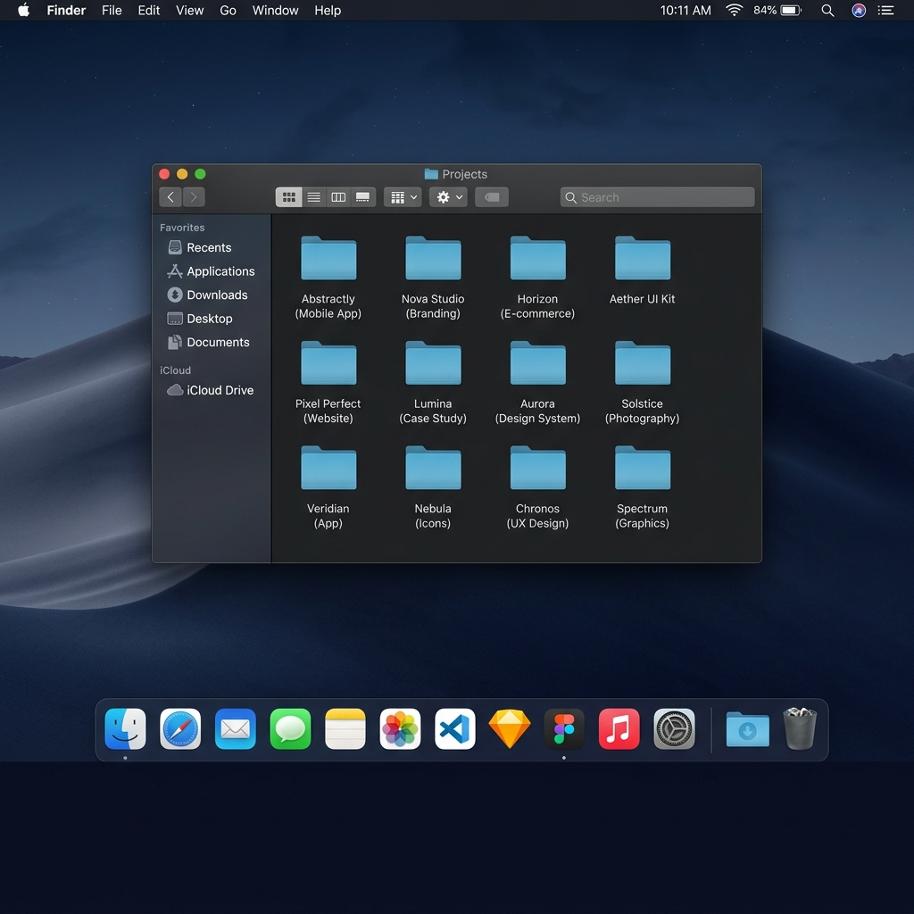

# Midun's Portfolio — macOS Style

A macOS-inspired interactive portfolio built entirely with vanilla HTML, CSS, and JavaScript. No frameworks. No dependencies.

Live at → **[midunp.vercel.app](https://midunp.vercel.app)**



---

## What it does

A fully interactive desktop experience running in the browser

- Draggable, resizable macOS windows
- Finder with real project folder navigation
- Working terminal with custom commands (try `skills`, `projects`, `sudo hire midun`)
- PDF resume viewer via PDF.js
- Spotlight search (`Ctrl + Space`)
- macOS dock with physics-based magnification
- Gallery / Photos window with real photos
- Contacts window with social links
- Experience timeline in a Safari-style window
- Dark / Light mode toggle via Control Center

---

## Tech stack

Intentionally minimal

- **HTML** — structure and all window markup
- **CSS** — macOS design system, animations, glassmorphism
- **JavaScript** — all interactivity, window management, terminal, dock physics
- **PDF.js** (CDN) — resume PDF rendering

No React. No Vue. No Tailwind. No build step.

---

## Running it locally

```bash
# Clone the repo
git clone https://github.com/MidunP/Portfolio.git
cd Portfolio

# Serve with any static server
npx serve .
# or
python -m http.server 8765
```

Open `http://localhost:3000` (or `8765`) in your browser.

---

## Customising it

All personal data lives in one file — **`data.js`**

```
data.js          ← edit your name, bio, projects, skills, socials, gallery
index.html       ← all markup, styles, and app logic
```

Update `data.js` and everything — terminal output, Finder, Contact, Resume, Experience — updates automatically.

---

## Project structure

```
Portfolio/
├── index.html          # Entire app (markup + styles + JS)
├── data.js             # Your personal data (edit this)
├── bg_new.png          # Wallpaper
├── superman.png        # Contact photo
├── MIDUN_SDE.pdf       # Resume PDF
├── photos/             # Gallery photos
├── icons/              # Dock icon fallbacks
└── socials/            # Social icon images
```

---

## Terminal commands

Open the terminal from the dock and try these

| Command | Description |
|---|---|
| `help` | List all commands |
| `about` | Developer introduction |
| `skills` | Tech stack |
| `projects` | List all projects |
| `whoami` | Short identity |
| `chess` | Chess project links |
| `open contact` | Open Contacts window |
| `open resume` | Open Resume window |
| `open gallery` | Open Gallery window |
| `clear` | Clear terminal |
| `sudo hire midun` | 👀 |

---

## Inspired by

[akashjana.xyz](https://akashjana.xyz) — original macOS portfolio concept by Akash Jana
